---
## Front matter
lang: ru-RU
title: Подготовка лабораторного стенда
subtitle: Лабораторная работа № 1
author:
  - Славинский В.В.
institute:
  - Российский университет дружбы народов, Москва, Россия
date: 12 сентября 2026

## i18n babel
babel-lang: russian
babel-otherlangs: english

## Formatting pdf
toc: false
toc-title: Содержание
slide_level: 2
aspectratio: 169
section-titles: true
---

# Информация

## Докладчик

- Славинский Владислав Вадимович
- Студент
- Российский университет дружбы народов

# Цель работы

## Цель работы

Цель лабораторной работы: приобрести практические навыки автоматизированной установки Rocky Linux на виртуальную машину с помощью Packer и управления лабораторным стендом средствами Vagrant и VirtualBox.

## Задание

- Сформировать box-файл с дистрибутивом Rocky Linux для VirtualBox.
- Запустить виртуальные машины сервера и клиента.
- Добавить пользователя с административными правами.
- Изменить имена хостов виртуальных машин.
- Подготовить файлы проекта для резервного копирования.

# Выполнение работы

## Подготовка программного обеспечения

Для выполнения лабораторной работы были установлены VirtualBox, Vagrant, Packer и файловый менеджер FAR.

## Рабочие каталоги

Были созданы рабочие каталоги для Packer и Vagrant. Каталог Packer использовался для сборки базового образа, а каталог Vagrant - для управления виртуальными машинами.

## Каталог Packer

В каталог Packer были помещены установочный образ Rocky Linux, файл конфигурации Packer, Kickstart-файл и вспомогательные сценарии.

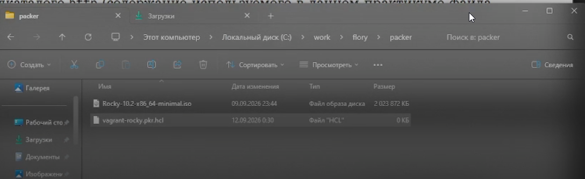

## Каталог Vagrant

В каталоге Vagrant были размещены `Vagrantfile`, `Makefile` и каталог `provision` со сценариями настройки виртуальных машин.

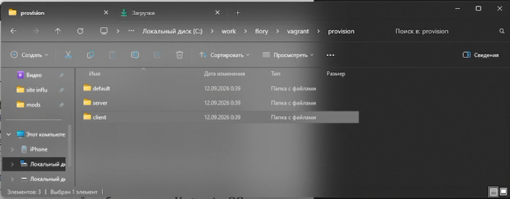

## Сценарий создания пользователя

В файле `provision/default/01-user.sh` был указан пользователь `vvslavinskiy`. Сценарий создаёт пользователя, назначает пароль и добавляет его в группу `wheel`.

## Сценарий изменения имени хоста

В файле `provision/default/01-hostname.sh` был настроен сценарий формирования имён хостов `server.vvslavinskiy.net` и `client.vvslavinskiy.net`.

## Настройка маршрутизации сервера

В каталоге `server` был подготовлен сценарий `02-forward.sh`. Он включает пересылку IPv4-пакетов и настраивает маскарадинг.

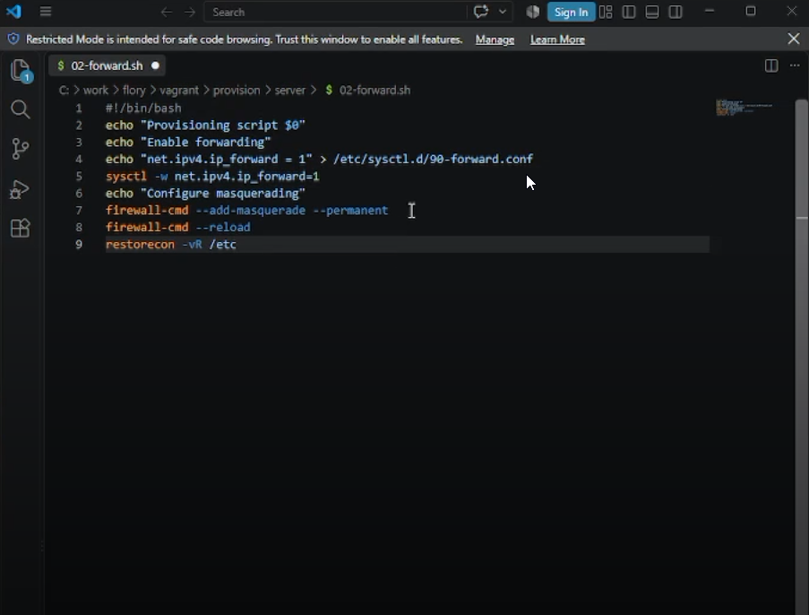

## Настройка клиента

В каталоге `client` был создан сценарий `01-routing.sh`. Он настраивает внутренний интерфейс `eth1` и запрещает использование маршрута по умолчанию через внешний интерфейс `eth0`.

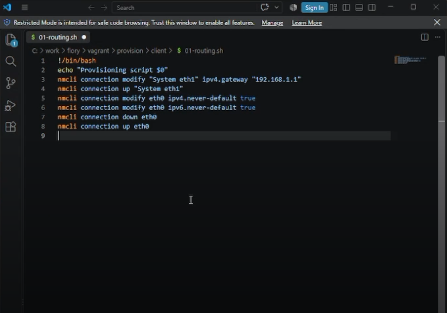

## Инициализация Packer

В каталоге Packer была выполнена инициализация необходимых плагинов командой `packer.exe init vagrant-rocky.pkr.hcl`.

## Сборка образа Rocky Linux

Сборка базового образа Rocky Linux была запущена командой `packer.exe build -only=virtualbox-iso.rockylinux vagrant-rocky.pkr.hcl`.

## Получение box-файла

После завершения сборки был получен файл `vagrant-virtualbox-rockylinux10-x86_64.box`.

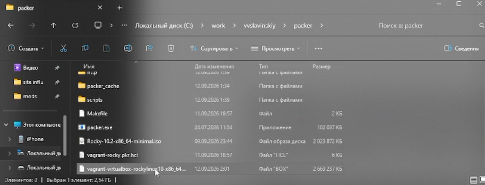

## Регистрация box-файла

Box-файл был скопирован в каталог Vagrant и зарегистрирован под именем `rockylinux10`.

## Запуск сервера

Из каталога Vagrant была запущена виртуальная машина сервера командой `vagrant up server`.

## Запуск клиента

Аналогично была запущена виртуальная машина клиента командой `vagrant up client`.

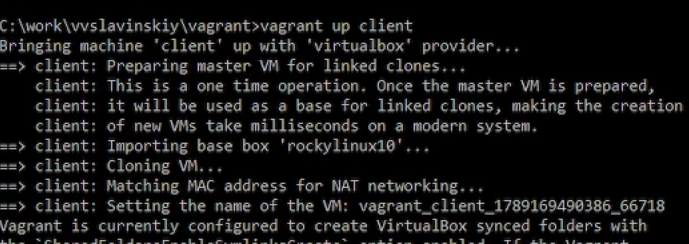

## Подключение к серверу

Работоспособность сервера была проверена подключением по SSH командой `vagrant ssh server`.

## Остановка виртуальных машин

После первичной проверки виртуальные машины сервера и клиента были корректно остановлены.

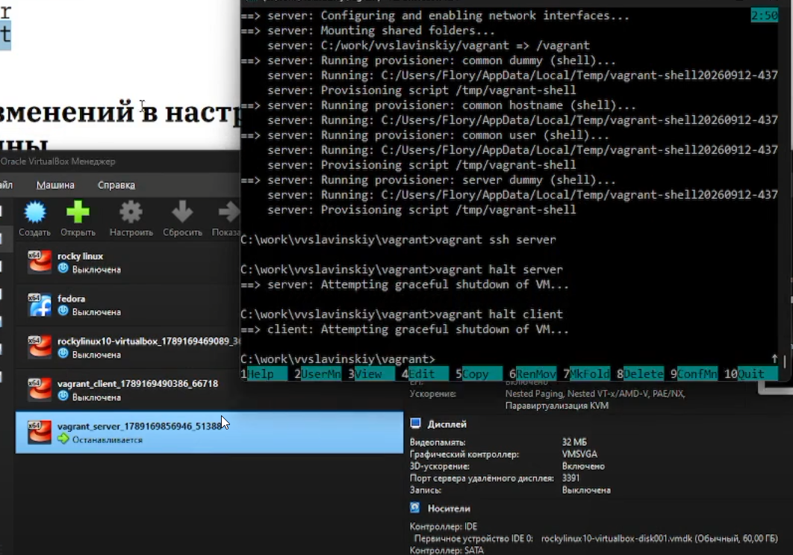

## Настройка Vagrantfile

В `Vagrantfile` были добавлены общие сценарии provisioning для изменения имени хоста и создания пользователя.

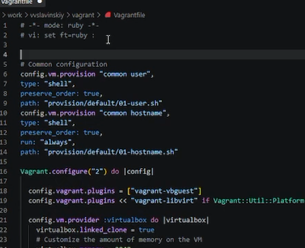

## Применение сценариев для сервера

Для сервера были применены сценарии настройки командой `vagrant up server --provision`.

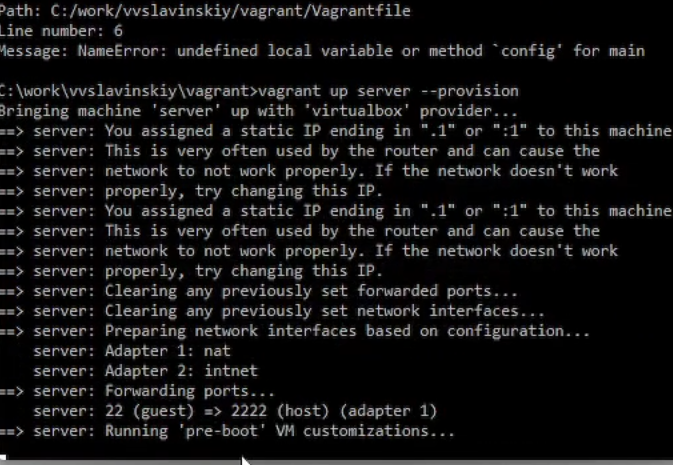

## Применение сценариев для клиента

Для клиента были применены сценарии настройки командой `vagrant up client --provision`.

## Проверка сервера

После подключения к серверу были проверены имя хоста и данные созданного пользователя.

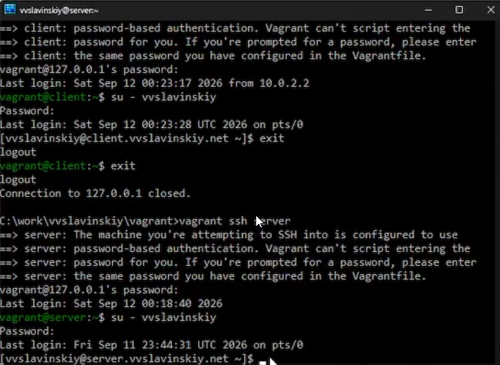

## Проверка клиента

После подключения к клиенту были проверены имя хоста и данные созданного пользователя.

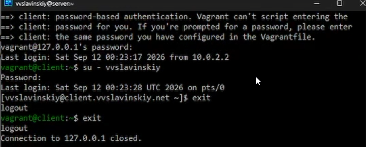

## Завершение работы стенда

После проверки обе виртуальные машины были остановлены командой `vagrant halt`.

# Выводы

## Выводы

В ходе лабораторной работы был сформирован box-файл Rocky Linux 10 для VirtualBox. С помощью Vagrant были развёрнуты виртуальные машины сервера и клиента. Сценарии provisioning создали пользователя с административными правами, изменили имена хостов и подготовили сетевые настройки стенда.
