---
## Front matter
title: "Лабораторная работа № 1"
subtitle: "Подготовка лабораторного стенда"
author: "Славинский Владислав Вадимович"

## Generic options
lang: ru-RU
toc-title: "Содержание"

## Bibliography
bibliography: bib/cite.bib
# csl: pandoc/csl/gost-r-7-0-5-2008-numeric.csl

## Pdf output format
toc: true
toc-depth: 2
lof: true
lot: true
fontsize: 12pt
linestretch: 1.5
papersize: a4
documentclass: scrreprt

## I18n polyglossia
polyglossia-lang:
  name: russian
  options:
    - spelling=modern
    - babelshorthands=true
polyglossia-otherlangs:
  name: english

## I18n babel
babel-lang: russian
babel-otherlangs: english

## Fonts
mainfont: DejaVu Serif
romanfont: DejaVu Serif
sansfont: DejaVu Sans
monofont: DejaVu Sans Mono
# mathfont disabled
mainfontoptions: Ligatures=Common,Ligatures=TeX,Scale=0.94
romanfontoptions: Ligatures=Common,Ligatures=TeX,Scale=0.94
sansfontoptions: Ligatures=Common,Ligatures=TeX,Scale=MatchLowercase,Scale=0.94
monofontoptions: Scale=MatchLowercase,Scale=0.94,FakeStretch=0.9

## Biblatex
biblatex: false
# biblio-style: "gost-numeric"
biblatexoptions:
  - parentracker=true
  - backend=biber
  - hyperref=auto
  - language=auto
  - autolang=other*
  - citestyle=gost-numeric

## Pandoc-crossref LaTeX customization
figureTitle: "Рис."
tableTitle: "Таблица"
listingTitle: "Листинг"
lofTitle: "Список иллюстраций"
lotTitle: "Список таблиц"
lolTitle: "Листинги"

## Misc options
indent: true
header-includes:
  - \usepackage{indentfirst}
  - \usepackage{float}
  - \floatplacement{figure}{H}
---

# Цель работы

Приобрести практические навыки автоматизированной установки Rocky Linux на виртуальную машину с помощью Packer и управления лабораторным стендом средствами Vagrant и VirtualBox.

# Задание

1. Сформировать box-файл с дистрибутивом Rocky Linux для VirtualBox.
2. Запустить виртуальные машины сервера и клиента и проверить их работоспособность.
3. Добавить пользователя с правами администратора и изменить имена хостов виртуальных машин `server` и `client`.
4. Подготовить файлы проекта и box-файл для резервного копирования и последующего развёртывания стенда.

# Выполнение лабораторной работы

## Подготовка программного обеспечения и рабочего каталога

Для выполнения лабораторной работы в Windows установим программы Vagrant, Packer и файловый менеджер FAR (рис. [-@fig:001]).

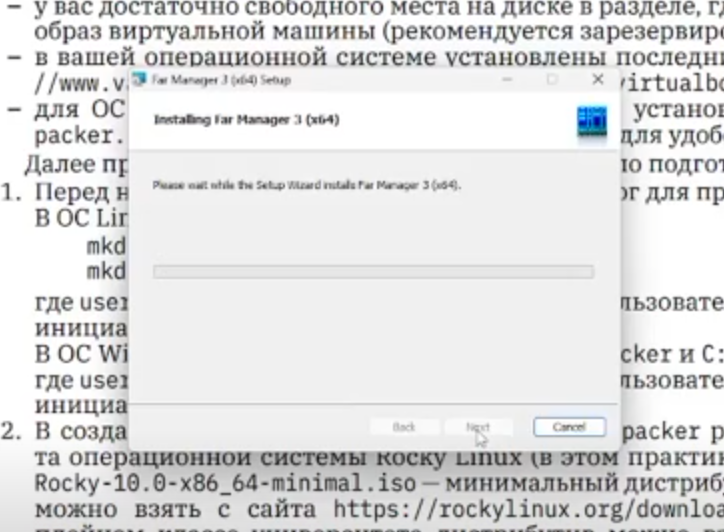{#fig:001 width=85%}

Создадим рабочие каталоги `C:\work\vvslavinskiy\packer` и `C:\work\vvslavinskiy\vagrant`. Первый каталог предназначен для автоматизированной сборки базового образа Rocky Linux, второй — для управления виртуальными машинами сервера и клиента (рис. [-@fig:002]).

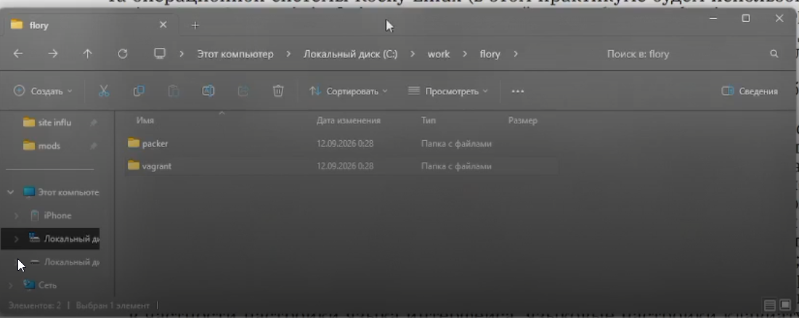{#fig:002 width=85%}

В каталог `packer` поместим установочный образ `Rocky-10.2-x86_64-minimal.iso`, файл конфигурации `vagrant-rocky.pkr.hcl`, каталог `http` с Kickstart-файлом `rocky10-ks.cfg` и вспомогательные сценарии (рис. [-@fig:003]).

{#fig:003 width=85%}

В каталоге `vagrant` разместим файлы `Vagrantfile` и `Makefile`. Создадим каталог `provision` с подкаталогами `default`, `server` и `client` для сценариев настройки виртуальных машин (рис. [-@fig:004]).

{#fig:004 width=85%}

## Настройка сценариев автоматизации

В файле `provision/default/01-user.sh` укажем имя пользователя `vvslavinskiy`. Сценарий создаёт пользователя, назначает ему пароль и включает его в административную группу `wheel` (рис. [-@fig:005]).

```bash
#!/bin/bash

echo "Provisioning script $0"

username=vvslavinskiy
userpassword=123456

encpassword=$(openssl passwd -6 ${userpassword})

if ! id -u "$username" >/dev/null 2>&1; then
	adduser -G wheel -p ${encpassword} ${username}
	homedir=$(getent passwd ${username} | cut -d: -f6)
	echo "export PS1='[\u@\H \W]\\$ '" >>${homedir}/.bashrc
fi
```

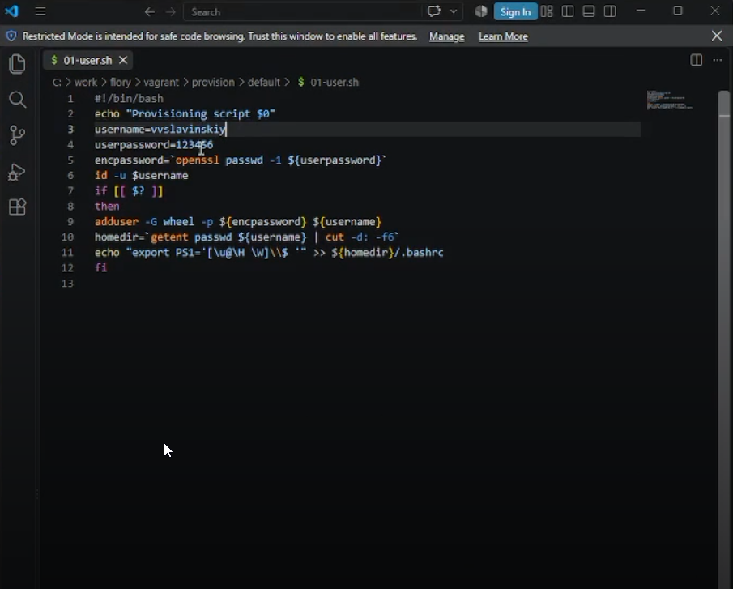{#fig:005 width=85%}

В файле `provision/default/01-hostname.sh` укажем тот же идентификатор пользователя. Сценарий формирует полные имена хостов `server.vvslavinskiy.net` и `client.vvslavinskiy.net` (рис. [-@fig:006]).

```bash
#!/bin/bash

username=vvslavinskiy
hostnamectl set-hostname "${HOSTNAME%%.*}".${username}.net
```

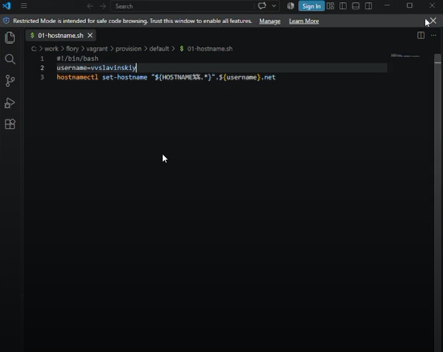{#fig:006 width=85%}

В каталоге `server` разместим сценарий `02-forward.sh`, включающий пересылку IPv4-пакетов и маскарадинг. Эти настройки позволяют серверу выполнять функции маршрутизатора (рис. [-@fig:007]).

```bash
#!/bin/bash

echo "Provisioning script $0"
echo "Enable forwarding"
echo "net.ipv4.ip_forward = 1" > /etc/sysctl.d/90-forward.conf
sysctl -w net.ipv4.ip_forward=1

echo "Configure masquerading"
firewall-cmd --add-masquerade --permanent
firewall-cmd --reload
restorecon -vR /etc
```

{#fig:007 width=85%}

В каталоге `client` разместим сценарий `01-routing.sh`. Он настраивает внутренний интерфейс `eth1`, а для внешнего интерфейса `eth0` запрещает использование маршрута по умолчанию (рис. [-@fig:008]).

```bash
#!/bin/bash

echo "Provisioning script $0"

nmcli -t -f NAME connection show | grep -qx eth1 || \
  nmcli connection add type ethernet ifname eth1 con-name eth1
nmcli connection modify eth1 ipv4.method auto ipv6.method link-local
nmcli connection up eth1

nmcli connection modify eth0 ipv4.never-default yes ipv6.never-default yes
nmcli device reapply eth0 || {
	nmcli connection down eth0
	nmcli connection up eth0
}
```

{#fig:008 width=85%}

## Формирование и регистрация box-файла

Перейдём в каталог `C:\work\vvslavinskiy\packer` и инициализируем необходимые плагины Packer командой (рис. [-@fig:009]):

```powershell
packer.exe init vagrant-rocky.pkr.hcl
```

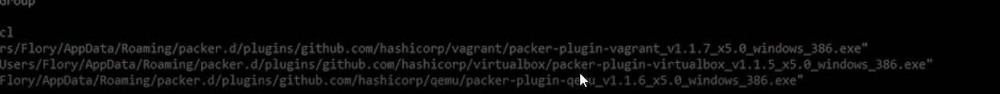{#fig:009 width=85%}

Запустим автоматическую установку Rocky Linux и формирование box-файла (рис. [-@fig:010]):

```powershell
packer.exe build -only=virtualbox-iso.rockylinux vagrant-rocky.pkr.hcl
```

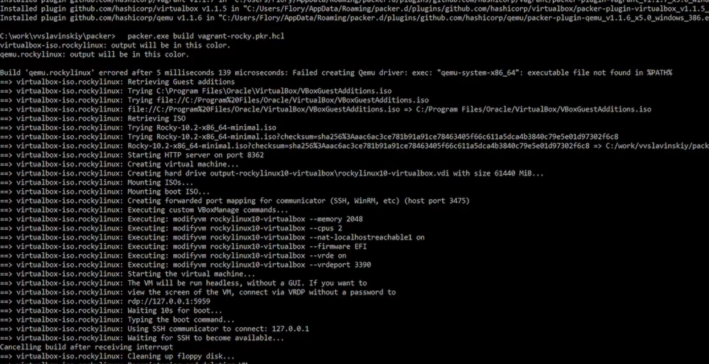{#fig:010 width=85%}

После завершения сборки в рабочем каталоге появился файл `vagrant-virtualbox-rockylinux10-x86_64.box` (рис. [-@fig:011]).

{#fig:011 width=85%}

Скопируем box-файл в каталог `vagrant` и зарегистрируем его под именем `rockylinux10` (рис. [-@fig:012]):

```powershell
vagrant box add rockylinux10 vagrant-virtualbox-rockylinux10-x86_64.box
```

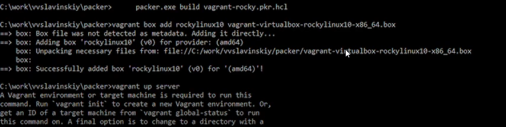{#fig:012 width=85%}

## Запуск и проверка виртуальных машин

Из каталога `C:\work\vvslavinskiy\vagrant` запустим виртуальную машину сервера (рис. [-@fig:013]):

```powershell
vagrant up server
```

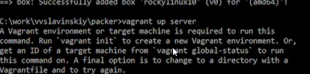{#fig:013 width=85%}

Аналогично запустим виртуальную машину клиента (рис. [-@fig:014]):

```powershell
vagrant up client
```

{#fig:014 width=85%}

Подключимся к серверу по SSH и проверим возможность входа в систему (рис. [-@fig:015]):

```powershell
vagrant ssh server
```

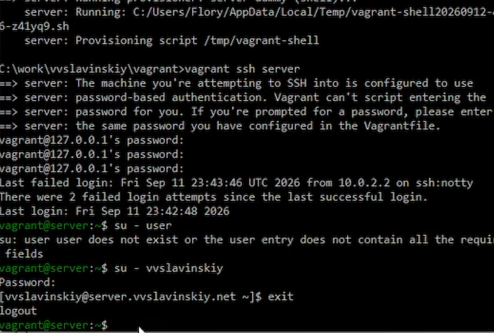{#fig:015 width=85%}

После первичной проверки завершим SSH-сеанс и остановим обе виртуальные машины:

```powershell
vagrant halt server
vagrant halt client
```

Результат корректной остановки машин представлен на рис. [-@fig:016].

{#fig:016 width=85%}

## Изменение внутреннего окружения

Добавим в общую конфигурацию `Vagrantfile` вызовы сценариев создания пользователя и изменения имени хоста:

```ruby
config.vm.provision "common hostname",
                    type: "shell",
                    preserve_order: true,
                    run: "always",
                    path: "provision/default/01-hostname.sh"

config.vm.provision "common user",
                    type: "shell",
                    preserve_order: true,
                    path: "provision/default/01-user.sh"
```

Внесённые изменения в `Vagrantfile` показаны на рис. [-@fig:017].

{#fig:017 width=85%}

Применим сценарии настройки сначала к серверу, затем к клиенту (рис. [-@fig:018], [-@fig:019]):

```powershell
vagrant up server --provision
vagrant up client --provision
```

{#fig:018 width=85%}

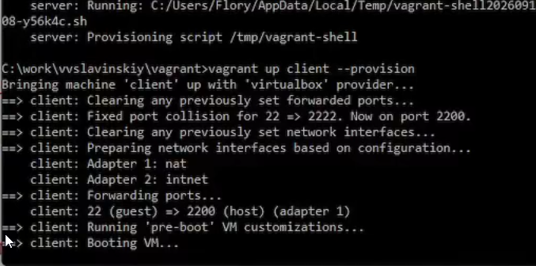{#fig:019 width=85%}

Подключимся к серверу и перейдём к созданному пользователю:

```powershell
vagrant ssh server
```

```bash
su - vvslavinskiy
hostname
id
```

Приглашение командной строки и команда `hostname` подтверждают, что пользователь создан, имеет необходимые права, а сервер получил имя `server.vvslavinskiy.net` (рис. [-@fig:020]).

{#fig:020 width=85%}

Аналогично подключимся к клиенту:

```powershell
vagrant ssh client
```

```bash
su - vvslavinskiy
hostname
id
```

В результате приглашение командной строки содержит имя `client.vvslavinskiy.net`, что подтверждает корректную настройку клиента (рис. [-@fig:021]).

{#fig:021 width=85%}

После проверки выйдем из SSH-сеансов и выключим обе виртуальные машины (рис. [-@fig:022]):

```powershell
vagrant halt client
vagrant halt server
```

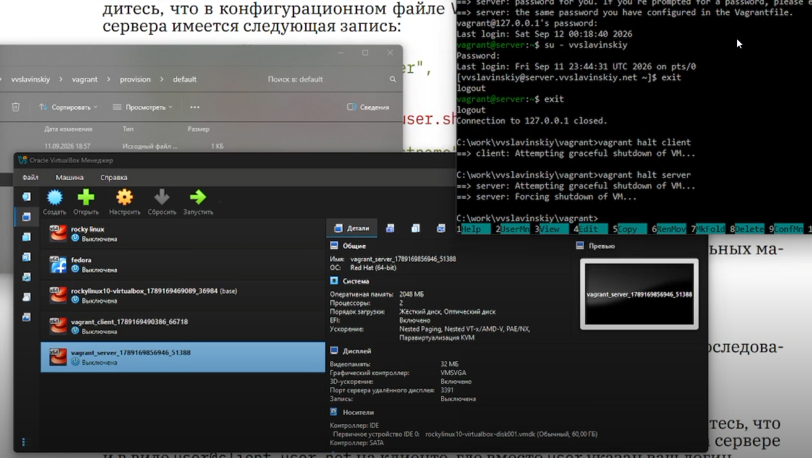{#fig:022 width=85%}

Скопируем файлы `vagrant-virtualbox-rockylinux10-x86_64.box`, `vagrant-rocky.pkr.hcl`, `rocky10-ks.cfg`, `Vagrantfile`, `Makefile` и каталог `provision` в каталог резервной копии. Эти файлы позволяют повторно развернуть лабораторный стенд на другом компьютере.

# Выводы

В ходе выполнения лабораторной работы был сформирован box-файл Rocky Linux 10 для VirtualBox. С помощью Vagrant были развёрнуты виртуальные машины сервера и клиента. Сценариями provisioning был создан пользователь `vvslavinskiy` с административными правами, изменены имена хостов и подготовлены сетевые настройки стенда. Работоспособность обеих виртуальных машин была подтверждена подключением по SSH.

# Ответы на контрольные вопросы

1. **Для чего предназначен Vagrant?**

   Vagrant предназначен для автоматизированного создания, настройки, запуска и удаления воспроизводимых виртуальных окружений. Параметры окружения описываются в `Vagrantfile`, благодаря чему один и тот же стенд можно развернуть на разных компьютерах.

2. **Что такое box-файл? В чём назначение Vagrantfile?**

   Box-файл представляет собой упакованный базовый образ виртуальной машины вместе с метаданными провайдера. `Vagrantfile` описывает, какой box-файл использовать, какие виртуальные машины создать, сколько ресурсов им выделить, как настроить сеть и какие сценарии provisioning выполнить.

3. **Основные команды Vagrant.**

   - `vagrant box list` — показать зарегистрированные box-файлы;
   - `vagrant box add NAME FILE` — зарегистрировать box-файл;
   - `vagrant init` — создать начальный `Vagrantfile`;
   - `vagrant up [VM]` — создать и запустить виртуальную машину;
   - `vagrant ssh [VM]` — подключиться к машине по SSH;
   - `vagrant provision [VM]` — повторно выполнить сценарии настройки;
   - `vagrant reload [VM]` — перезагрузить машину с применением конфигурации;
   - `vagrant halt [VM]` — корректно выключить машину;
   - `vagrant destroy [VM]` — удалить созданную виртуальную машину;
   - `vagrant status` — показать состояние машин.

4. **Назначение конфигурационных файлов.**

   Файл `vagrant-rocky.pkr.hcl` задаёт источники и версии плагинов Packer, параметры Rocky Linux, контрольную сумму ISO, характеристики виртуальной машины, команды автомат boot-процесса, сценарии подготовки системы и формирование итогового box-файла. Файл `rocky10-ks.cfg` автоматизирует установку Rocky Linux: настраивает загрузчик, разделы, язык, клавиатуру, сеть, пользователей, SSH, службы и набор пакетов. `Vagrantfile` описывает общие параметры провайдера VirtualBox, машины `server` и `client`, внутреннюю сеть и выполняемые сценарии provisioning. `Makefile` объединяет типовые команды проверки провайдера, установки плагинов, регистрации box-файла, запуска, настройки, остановки и удаления виртуальных машин.
